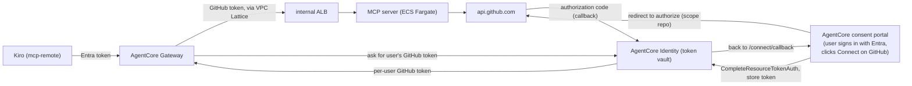

# GitHub MCP for Kiro: ECS behind AgentCore Gateway + Identity, Entra ID



- **Inbound:** the gateway validates Entra v2 access tokens (`CUSTOM_JWT`, audience = app ID).
- **Outbound:** the gateway brokers GitHub OAuth (Authorization Code / 3LO) and forwards the
  user's GitHub token as `Authorization: Bearer` to the MCP server. The server has no identity code.
- **Consent / session binding:** the AWS-managed AgentCore consent portal. A RESPONSE interceptor
  Lambda rewrites the gateway's `-32042` consent link to the portal URL.
- **Private path:** the MCP server has no public endpoint. The gateway reaches the internal ALB
  through a VPC Lattice resource gateway in the private subnets.

The full walkthrough, especially how identity works, is in [`docs/HOW-IT-WORKS.md`](docs/HOW-IT-WORKS.md).

## What gets deployed

| Piece | How | Name |
|---|---|---|
| Gateway, GitHub + Entra OAuth2 credential providers, portal execution role, interceptor Lambda, gateway logs | CloudFormation `templates/02-gateway-identity.yaml` (deployed twice, see below) | `github-mcp-ecs-gateway` |
| VPC, NAT, internal ALB (HTTPS, public ACM cert), private hosted zone, ECS Fargate service | CloudFormation `templates/01-network-ecs.yaml` | `github-mcp-ecs-network` |
| Gateway target (private endpoint, inline tool schema, OAuth `AUTHORIZATION_CODE`, scope `repo`) | CloudFormation `templates/03-mcp-target.yaml` | `github-mcp-ecs-target` |
| Consent portal; allowed return URL on the gateway's workload identity | boto3, `scripts/deploy-portal.py` (no CloudFormation type/property exists) | `github-mcp-ecs-consent-portal` |
| Container image | podman, built from `mcp_server/` | ECR `github-mcp-ecs-mcp:src-<hash of the source>` |

Created by hand, outside this repo: the Entra app registration, the GitHub OAuth App, the two
client secrets in Secrets Manager, and the ACM certificate for the MCP's DNS name (DNS-validated
in a public zone you control).

## Prerequisites

1. **Entra app registration**: see [`docs/ENTRA-SETUP.md`](docs/ENTRA-SETUP.md). Needs a client
   secret for the portal, stored in Secrets Manager as `{"client_secret":"..."}`.
2. **GitHub OAuth App**: see [`docs/GITHUB-SETUP.md`](docs/GITHUB-SETUP.md). Its client secret in
   Secrets Manager as `{"client_secret":"..."}`.
3. **Public ACM certificate** for the MCP's private DNS name (`MCP_DOMAIN_NAME`), issued in
   the deployment region. The ALB stays internal; the name only resolves inside the VPC.
4. Tools: AWS CLI, `podman` (or set `CONTAINER_CLI=docker`), Python 3 with
   `boto3`/`botocore >= 1.43.88` (consent-portal APIs).

## Deploy

```bash
cp .env.example .env   # fill in the values
# ensure your shell has valid AWS credentials for AWS_PROFILE
./scripts/deploy.sh
```

The script runs six steps: image (skipped if already in ECR); gateway stack (first pass);
consent portal (boto3); network/ECS stack; target stack (return URL = `<portal-url>/connect/callback`);
gateway stack again with `PortalUrl`/`PortalArn` set, which attaches the interceptor and pins the
portal role's trust to this portal. Step 3 writes
`PORTAL_ID`, `PORTAL_ARN`, `PORTAL_URL`, `PORTAL_CALLBACK_URL` and `PORTAL_CONNECT_RETURN_URL` back
to `.env`.

On a fresh deployment, two manual steps follow:
- Entra app → Authentication → **Web** → add `<portal-url>/callback` exactly, without a trailing slash.
- GitHub OAuth App → add the GitHub provider's callback URL
  (`https://bedrock-agentcore.<region>.amazonaws.com/identities/oauth2/callback/<id>`; `aws
  bedrock-agentcore-control get-oauth2-credential-provider --name github-mcp-provider`
  returns it as `callbackUrl`).

Re-running the script on an existing deployment with unchanged files changes nothing: the image
tag is a hash of `mcp_server/`, so an unchanged source skips the build, the stacks get
empty changesets, the first gateway pass keeps the stack's current portal values, and the portal
is reused by name. A changed server source gets a new tag and an ECS rolling deployment.

## Connect Kiro

Merge [`kiro/mcp.json`](kiro/mcp.json) into your Kiro MCP config (template:
[`kiro/mcp.json.example`](kiro/mcp.json.example)). Kiro connects through `mcp-remote` with
`--disable-resource-parameter`, because Entra rejects the RFC 8707 `resource` parameter that
Kiro's built-in remote-MCP sign-in sends (`AADSTS9010010`).

First GitHub tool call: Kiro shows the portal link → sign in with Entra → Connect GitHub →
approve → retry the tool call in Kiro.

## Reset consent for testing

The portal has no Disconnect button. Either revoke the OAuth App in GitHub (Settings →
Applications → Authorized OAuth Apps), or test with a second Entra user, since tokens are stored
per Entra user.

## Layout

```
templates/01-network-ecs.yaml              VPC, NAT, internal ALB (HTTPS/ACM), private DNS, Lattice SG, ECS Fargate
templates/02-gateway-identity.yaml         Gateway (MCP 2025-11-25, Entra JWT), GitHub + Entra credential providers,
                                           portal execution role, RESPONSE interceptor, gateway APPLICATION_LOGS
templates/03-mcp-target.yaml               Gateway target: private endpoint, inline tool schema, OAuth AUTHORIZATION_CODE
mcp_server/                                GitHub MCP server (FastMCP, streamable HTTP); uses the forwarded bearer token
scripts/deploy.sh                          End-to-end deploy (six steps)
scripts/deploy-portal.py                   Consent portal, role trust pinning, workload-identity return URL
kiro/mcp.json                              Kiro config for this deployment
docs/HOW-IT-WORKS.md                       End-to-end and identity walkthrough (shareable)
docs/ENTRA-SETUP.md, docs/GITHUB-SETUP.md  External app registrations
```

## Known limits

- The gateway can't enforce Entra scopes (the token's `scp` has the short name, the request
  needs the full URI); it checks the audience only. Use "Assignment required" on the Entra
  enterprise app to control who can sign in.
- One GitHub scope set per target (`repo`); scopes can't vary per tool.
- The gateway endpoint itself is public (authenticated); only the MCP server is private.
